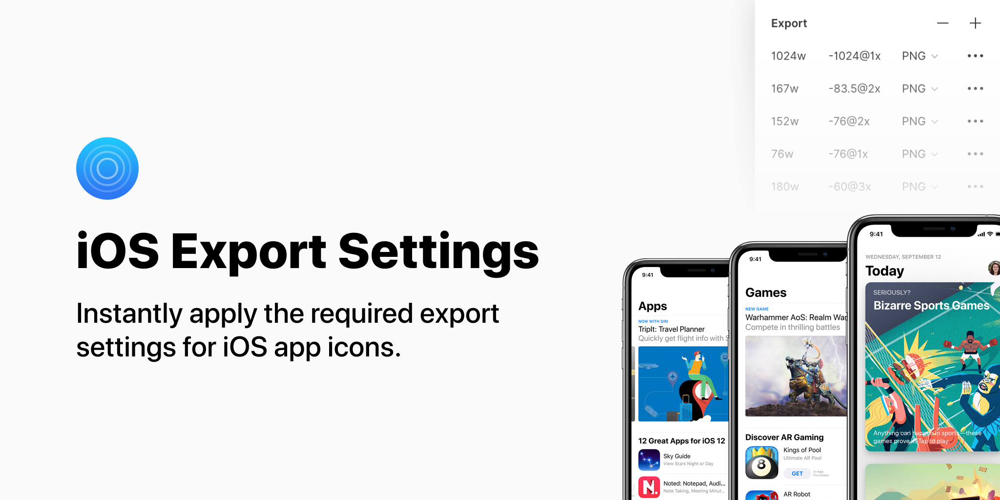

  

# Figma iOS Export Settings 📱

Instantly apply the required export settings for iOS app icons.

[Install on Figma]()

## Usage

1. Select a frame containing your app icon.
2. Press `command + /` and search for 'iOS Export Settings'
3. Run the plugin
4. `command + shift + p` to re-run the plugin instantly
 
## Installation and contributing

1. Clone the repository: `git clone https://github.com/brianlovin/figma-ios-export-settings.git`
1. Go to the directory: `cd figma-ios-export-settings`
1. Install `figplug`: `npm i -g figplug`
1. Build the plugin: `figplug build -w -o=build`
1. Add a new development plugin to Figma
1. Select the `figma-ios-export-settings/build/manifest.json` file as the manifest